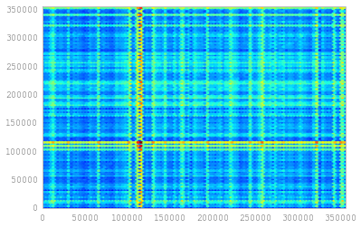
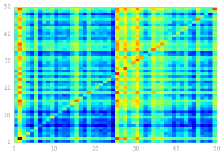
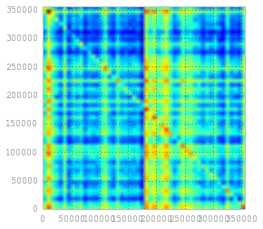
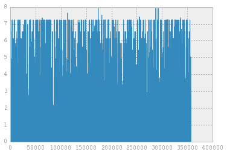

Introduction
============

PyDSM is a lightweight Python 3 framework for building and exploring
distributional semantic models with focus on extensibility and ease of
use.

The IndexMatrix
---------------

At its core is the IndexMatrix class, which provides a sparse matrix
representation with string representations of the word and column index.
Much of its functionality is inspired by the Pandas DataFrame, but since
the DataFrame performs poorly in sparse situations (SparseDataFrame
converts too often to its dense representation), the IndexMatrix will
due for now.

The DSMs
--------

There are two models included in the package: A simple cooccurrence
matrix model (CooccurrenceDSM), and the Random Indexing model. Building
new models can be done by creating a class extending pydsm.model.DSM,
and providing the following: - A ``_build`` method for building the DSM
as a dictionary of dictionary of values. - A ``_new_instance`` method
for creating new instances of the model.

Examples
========

Building a DSM
--------------

.. code:: python

    import pydsm
    cooc = pydsm.build(pydsm.CooccurrenceDSM, corpus='wiki.20k', window_size=(2,2), language='en')
    cooc

.. parsed-literal::

       98% [================================================================ ]
    
    Total time: 149.80 s

.. parsed-literal::

    CooccurrenceDSM
    Vocab size: 356916
    [356916, 356916]  metius  synechism  hermandiederik  ...
    igazság           0.0     0.0        0.0             ...
    kformula          0.0     0.0        0.0             ...
    synechism         0.0     0.0        0.0             ...
    ...               ...     ...        ...             ...

Apply weighting
---------------

.. code:: python

    import pydsm.weighting as weighting
    ppmi = cooc.apply_weighting(weight_func=weighting.ppmi)
    ppmi

.. parsed-literal::

    CooccurrenceDSM
    Vocab size: 356916
    [356916, 356916]  metius  synechism  hermandiederik  ...
    igazság           0.0     0.0        0.0             ...
    kformula          0.0     0.0        0.0             ...
    synechism         0.0     0.0        0.0             ...
    ...               ...     ...        ...             ...

Finding nearest neighbors
-------------------------

.. code:: python

    import pydsm.similarity as similarity
    ppmi.nearest_neighbors('moon', sim_func=similarity.cos)

.. parsed-literal::

    [356916, 1]  moon
    moon         0.9999999999999996
    moons        0.10031087979984758
    dysnomia     0.08623286288348603
    pluto        0.08572034915790229
    lunar        0.08285183916068635
    sailor       0.08276499255478217
    menazil      0.07943614314690178
    alkamar      0.07943614314690178
    senshi       0.07882882415306644
    mars         0.07846039338300181
    ...          ...

Compose
-------

.. code:: python

    import pydsm.composition as composition
    car_brand = ppmi.compose('black', 'white', comp_func=composition.multiplicative)
    car_brand

.. parsed-literal::

    [1, 356916]  metius  synechism  hermandiederik  wendt  settheory  elderselect  kolkha  ...
    black white  0.0     0.0        0.0             0.0    0.0        0.0          0.0     ...

.. code:: python

    ppmi.nearest_neighbors(car_brand, sim_func=similarity.cos)

.. parsed-literal::

    [356916, 1]        black white
    white              0.32082268788455864
    black              0.3120890846417935
    orangebrownorange  0.1150050121381072
    superauto          0.11211844385043106
    upperparts         0.10831323874421267
    whitegraywhite     0.10710022284277554
    blue               0.10413968267114806
    red                0.1034924372826562
    yellow             0.10085997033212568
    nonhispanic        0.09767574768550827
    ...                ...

Selection
---------

Selections can be made in several ways: by word index, integer index,
slices, boolean numpy arrays.

.. code:: python

    ppmi['rock']  # Row selection

.. parsed-literal::

    [1, 356916]  metius  synechism  hermandiederik  wendt  settheory  elderselect  kolkha  ...
    rock         0.0     0.0        0.0             0.0    0.0        0.0          0.0     ...

.. code:: python

    ppmi[['correa', 'rock']]  # Multiple rows slection

.. parsed-literal::

    [2, 356916]  metius  synechism  hermandiederik  wendt  settheory  elderselect  kolkha  ...
    correa       0.0     0.0        0.0             0.0    0.0        0.0          0.0     ...
    rock         0.0     0.0        0.0             0.0    0.0        0.0          0.0     ...

.. code:: python

    ppmi['good', 'bad']  # Value selection

.. parsed-literal::

    3.7391712801558179

.. code:: python

    ppmi[100:105]  # Rows 100 to 104

.. parsed-literal::

    [5, 356916]  metius  synechism  hermandiederik  wendt  settheory  elderselect  kolkha  ...
    bond         0.0     0.0        0.0             0.0    0.0        0.0          0.0     ...
    jails        0.0     0.0        0.0             0.0    0.0        0.0          0.0     ...
    bilton       0.0     0.0        0.0             0.0    0.0        0.0          0.0     ...
    kasama       0.0     0.0        0.0             0.0    0.0        0.0          0.0     ...
    iceland      0.0     0.0        0.0             0.0    0.0        0.0          0.0     ...

.. code:: python

    ppmi[:, ['good', 'bad']]  # Column selection

.. parsed-literal::

    [356916, 2]     good  bad
    igazság         0.0   0.0
    kformula        0.0   0.0
    synechism       0.0   0.0
    hermandiederik  0.0   0.0
    settheory       0.0   0.0
    elderselect     0.0   0.0
    kolkha          0.0   0.0
    chávezpernell   0.0   0.0
    exoticism       0.0   0.0
    nezek           0.0   0.0
    ...             ...   ...

.. code:: python

    ppmi[9000:9010, [0,4,5]]  # Mixing

.. parsed-literal::

    [10, 3]       metius  settheory  elderselect
    skåne         0.0     0.0        0.0
    tausha        0.0     0.0        0.0
    delusions     0.0     0.0        0.0
    maître        0.0     0.0        0.0
    guichard      0.0     0.0        0.0
    prig          0.0     0.0        0.0
    lindigénat    0.0     0.0        0.0
    wzo           0.0     0.0        0.0
    manatees      0.0     0.0        0.0
    yorkshiremen  0.0     0.0        0.0

Visualize
=========

.. code:: python

    %matplotlib inline
    import pydsm.visualization as visualization
    visualization.hexbin(ppmi)

.. code:: python

    visualization.pcolormesh(ppmi)

.. code:: python

    visualization.heatmap(ppmi)

.. code:: python

    visualization.plot_vector(ppmi['model'])

IndexMatrix operations
----------------------

The IndexMatrix is the core of PyDSM. You have already seen the
selection functionality, which is a part of the IndexMatrix. Here are
some common operations.

.. code:: python

    from pydsm import IndexMatrix
    mat = ppmi.matrix
    mat.sum(axis=1)  # Sum the matrix row-wise

.. parsed-literal::

    [356916, 1]
    igazság         18.683354595341434
    kformula        40.96849948072415
    synechism       45.74842250518874
    hermandiederik  43.97133364222774
    settheory       25.393081207234648
    elderselect     18.049973280566153
    kolkha          55.663220171576725
    chávezpernell   44.70748059925722
    exoticism       118.33632351892375
    nezek           48.6589983850974
    ...             ...

.. code:: python

    srted = mat.sum(axis=1).sort(ascending=False)  # Sum the matrix along the rows, and sort it.
    srted

.. parsed-literal::

    [356916, 1]
    and          161771.25962282284
    the          93471.16046956484
    in           92074.9645661122
    of           89557.50082065431
    a            87442.98215496707
    by           77974.95155686601
    as           77812.6773046294
    is           76331.9051760016
    or           73657.61317815434
    with         67192.71160663095
    ...          ...

.. code:: python

    deleted = mat.delete(srted[:100], axis=0)  # Delete the 100 first rows in srted. 
    deleted.sort(axis=0, key=IndexMatrix.sum, ascending=False)  # Sort the matrix according to to sum function. 
                                                                #Note that the hundred first rows are removed.

.. parsed-literal::

    [356816, 356916]  metius  synechism  hermandiederik  wendt  settheory  elderselect  kolkha  ...
    under             0.0     0.0        0.0             0.0    0.0        0.0          0.0     ...
    la                0.0     0.0        0.0             0.0    0.0        0.0          0.0     ...
    along             0.0     0.0        0.0             0.0    0.0        0.0          0.0     ...
    son               0.0     0.0        0.0             0.0    0.0        0.0          0.0     ...
    several           0.0     0.0        0.0             0.0    0.0        0.0          0.0     ...
    will              0.0     0.0        0.0             0.0    0.0        0.0          0.0     ...
    if                0.0     0.0        0.0             0.0    0.0        0.0          0.0     ...
    group             0.0     0.0        0.0             0.0    0.0        0.0          0.0     ...
    among             0.0     0.0        0.0             0.0    0.0        0.0          0.0     ...
    so                0.0     0.0        0.0             0.0    0.0        0.0          0.0     ...
    ...               ...     ...        ...             ...    ...        ...          ...     ...

.. code:: python

    std = deleted.std(axis=1)  # Return the rowwise standard deviation
    std

.. parsed-literal::

    [356816, 1]
    igazság         0.025172048090453064
    kformula        0.03520336028415321
    synechism       0.031798419122155516
    hermandiederik  0.039468230971881554
    settheory       0.023419946322277188
    elderselect     0.019982330351386298
    kolkha          0.043269778486696
    chávezpernell   0.0374793532399878
    exoticism       0.05115875151354828
    nezek           0.03695091072200877
    ...             ...

.. code:: python

    std + 5

.. parsed-literal::

    [356816, 1]
    igazság         5.025172048090453
    kformula        5.035203360284153
    synechism       5.031798419122156
    hermandiederik  5.039468230971882
    settheory       5.023419946322277
    elderselect     5.019982330351386
    kolkha          5.043269778486696
    chávezpernell   5.037479353239988
    exoticism       5.051158751513548
    nezek           5.036950910722009
    ...             ...

.. code:: python

    std / 0.5

.. parsed-literal::

    [356816, 1]
    igazság         0.05034409618090613
    kformula        0.07040672056830642
    synechism       0.06359683824431103
    hermandiederik  0.07893646194376311
    settheory       0.046839892644554376
    elderselect     0.039964660702772596
    kolkha          0.086539556973392
    chávezpernell   0.0749587064799756
    exoticism       0.10231750302709657
    nezek           0.07390182144401754
    ...             ...

.. code:: python

    (std * std).sqrt()  # Multply elementwise by itself, and return the square root

.. parsed-literal::

    [356816, 1]
    igazság         0.025172048090453064
    kformula        0.03520336028415321
    synechism       0.031798419122155516
    hermandiederik  0.039468230971881554
    settheory       0.023419946322277188
    elderselect     0.019982330351386298
    kolkha          0.043269778486696
    chávezpernell   0.0374793532399878
    exoticism       0.05115875151354828
    nezek           0.03695091072200877
    ...             ...

.. code:: python

    srted.append(ppmi[:,'word'], axis=1)  # Append another matrix column-wise and match index row

.. parsed-literal::

    [356916, 2]                      word
    and          161771.25962282284  0.0
    the          93471.16046956484   0.826469869794669
    in           92074.9645661122    0.0
    of           89557.50082065431   0.0
    a            87442.98215496707   0.49578159524844034
    by           77974.95155686601   0.0
    as           77812.6773046294    0.0
    is           76331.9051760016    1.134261702619963
    or           73657.61317815434   0.48493322980887776
    with         67192.71160663095   0.0
    ...          ...                 ...

